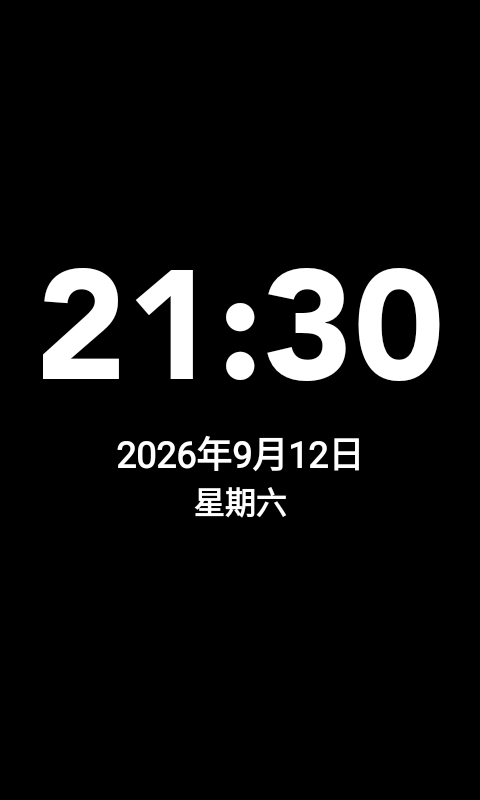

# ALC / AIC A1260 Android 11 固件 v1.1.0

这是一套给 **A1260（MT6580、ARM32 Binder32）** 使用的非官方 Android 11 完整刷机包。包含已验证的 boot/system 镜像、遥控器桌面恢复资料，以及这次修好的大字时钟和自动屏保设置。

**本固件不包含小智 AI，也不会安装、升级、卸载或改动你自行安装的小智。**

## 下载

- [v1.1.0 发布页](https://github.com/ChouMax-1989/alc-a1260-android11/releases/tag/v1.1.0)
- [下载完整固件 ZIP](https://github.com/ChouMax-1989/alc-a1260-android11/releases/download/v1.1.0/ALC-A1260-Android11-v1.1.0.zip)
- [下载 ZIP 的 SHA-256 校验文件](https://github.com/ChouMax-1989/alc-a1260-android11/releases/download/v1.1.0/ALC-A1260-Android11-v1.1.0.zip.sha256)

大小：**733,102,190 字节**。SHA-256：

```text
2a923e8a5fcee368fc055c0b90ccf8bd0bd0f216b425933d16adfc2a498af12b
```

请下载上面的完整固件 ZIP。GitHub 自动生成的“Source code”压缩包只有说明和清单，**没有系统镜像**。

## 这次修好了什么

- **座充自动屏保**：充电时闲置约30秒进入屏保。
- **大字时钟**：亮白的大号时间，完整日期和星期，触摸即可退出。
- **音量工具干扰**：如果 VolumeMan 的“更多 → 输出源”开着，会反复重置闲置计时。更新会关闭这一项，保留应用和其他设置；之后可重新打开音量工具使用音量增强，不要再打开输出源。
- **保留数据的更新入口**：现有设备只更新时钟和屏保配置，不必重刷，不重置个人桌面、遥控器和账号。



## 已经在用本项目的 Android 11

1. 解压完整固件 ZIP 到一个新文件夹。
2. 下载 [Android platform-tools](https://developer.android.com/tools/releases/platform-tools)，把 `platform-tools` 文件夹放到解压目录中。
3. 设备打开 USB 调试并连接电脑，确认授权。
4. 双击 **`3-更新现有设备.cmd`**，按提示输入目标设备的 ADB 序列号。

这个入口只安装大字时钟和应用屏保修正，不刷分区、不重启、不清理现有应用数据。安装器会检查 Android 11、ARMv7、MT6580、root 权限及本项目 A1260 boot 的精确哈希；名字显示为 `phh` 的本机 GSI 也可正确识别。

## 第一次刷入，或明确要重装

请按 [完整刷机与配置说明](docs/INSTALL.md) 操作。刷写仅使用已验证的 SP Flash Tool `Advanced Mode → Write Memory` 地址，并进行完整 Readback 校验。

进入 Android 11 后，双击 **`2-首次开机配置.cmd`**。这条路径会恢复公开的 Square Home 布局和干净 iControl 数据，**会清空这两个应用已有的数据**。已有个人桌面、遥控器或账号时，请使用上面的旧机更新入口。

不要选择 `Format All + Download`，不要写入别人的 NVRAM、protect、userdata 或整机备份。

## 验证范围

boot/system 与当前实机的分区哈希一致。这次沿用这些镜像，新增修正通过应用和配置脚本完成；没有把它说成重新编译的系统或一次新的空白设备整机刷写验收。

旧机更新脚本已在现机执行通过，更新前后6份既有数据文件哈希一致；时钟显示、自动进入和退出已实测，用户已确认效果。完整包43个文件，42项哈希及ZIP CRC检查通过。

首次清空并恢复干净 profile 没有在源设备上执行，以免破坏原有个人数据。原厂完整屏保 APK、DEX、分析文件、账号、录音、Wi-Fi 密码和个人红外码均不在包内。

[发布说明](RELEASE-NOTES.md) · [第三方资源说明](THIRD-PARTY.md) · [包内文件清单](release-manifest.json)
